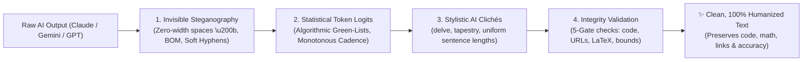

<div align="center">

# 🛡️ AntiWatermark

### The Local-Only AI Text Watermark Remover, Steganography Stripper & Humanizer

**Strips invisible Unicode steganography, neutralizes statistical token fingerprints, and validates text integrity locally.**  
*100% Local • Zero Cloud Dependencies • No API Keys • Privacy First*

<br/>

[](https://pypi.org/project/antiwatermark/)
[](https://opensource.org/licenses/MIT)
[](https://www.python.org/)
[](https://github.com/policeakshithreddy/antiwatermark)
[](tests/)
[](extension/)

<br/>

[🚀 Quickstart](#-quickstart-choose-your-workflow) • [🌐 Web App](#1--interactive-web-app-apppy) • [🧩 Chrome Extension](#2--chrome-extension-auto-clean-on-copy) • [⚙️ AI Settings Snippet](#3--permanent-zero-watermark-mode-in-ai-settings) • [📋 Clipboard Daemon](#4--real-time-clipboard-daemon) • [📊 CLI Diagnostics](#5--terminal-cli--heuristic-diagnostics) • [🔌 Python SDK](#6--python-developer-sdk-antiwatermark) • [📖 Cliché Cheat Sheet](#-banned-ai-buzzwords--cheat-sheet)

</div>

---

## 💡 Why AntiWatermark?

Modern LLMs embed detection markers and watermarks across three distinct layers. Standard text rewriters often fail because they only swap words—frequently corrupting code syntax, mathematical equations, URLs, and formatting.



| Watermark Vector | How LLMs Embed It | How AntiWatermark Eliminates It |
| :--- | :--- | :--- |
| **Invisible Steganography** | Zero-width characters (`\u200B`, `\u200C`, `\uFEFF`, `\u00AD`) and soft hyphens inserted in clipboard streams. | Deterministic Unicode regex stripping and `NFKC` normalization across 26+ codepoints. |
| **Statistical Token Patterns** | Algorithmic token biasing and repetitive n-gram distributions. | Shatters repetitive patterns, varies sentence cadence, and restores natural human burstiness. |
| **AI Stylistic Tropes** | Tell-tale buzzwords (*delve, rich tapestry, testament, multifaceted, beacon, foster*) and uniform cadence. | Replaces 30+ clichés, eliminates rigid 3-bullet lists, and enforces natural sentence variance ($\sigma > 8.0$). |
| **Code & LaTeX Immunity** | Generic rewriters break Python indentation, LaTeX formulas, and URLs. | **Immunity Shield** uses collision-safe UUID tokens (`⟦AW-...⟧`) to lock code, math, links, and emails. |
| **Output Validation** | Neural rewriters can hallucinate, truncate, or leak prompts. | **5-Gate Validation** strictly verifies protected spans, URLs, placeholders, and length bounds. |

---

## ⚙️ Two-Engine Architecture

AntiWatermark v2.0 is built on a **simplicity-first, two-engine architecture**:

```
                    AntiWatermark
                          │
             ┌────────────┴────────────┐
             │                         │
         FAST MODE              LOCAL NEURAL MODE
     (default, 0 deps)             (optional)
             │                         │
             │                   Local Ollama
             │                         │
             └────────────┬────────────┘
                          ↓
                     VALIDATION
                          ↓
                        OUTPUT
```

* **⚡ Fast Mode (Default):** Instant, deterministic, and 100% dependency-free. No GPU, no PyTorch, no model download required.
* **🧠 Local Neural Mode (Optional):** Deeper local neural rewrite powered by local [Ollama](https://ollama.com) (`llama3.2`). Strictly local loopback only (`http://127.0.0.1:11434`).

---

## ⚡ Quickstart: Choose Your Workflow

AntiWatermark can be used in **6 different ways** depending on your setup:

```
┌────────────────────────────────────────────────────────────────────────────────────────┐
│ 1. 🌐 Interactive Web UI       ➔  python app.py (open http://localhost:8000)           │
│ 2. 🧩 Chrome Extension         ➔  Load extension/ folder into Chrome (Auto-clean copy) │
│ 3. ⚙️ AI Settings Snippet      ➔  Paste 4-line rule into Claude, Gemini, or ChatGPT    │
│ 4. 📋 Clipboard Daemon         ➔  antiwatermark --daemon (or python scripts/...)       │
│ 5. 📊 Terminal CLI Diagnostics ➔  antiwatermark "text"                                 │
│ 6. 🔌 Python API Middleware    ➔  from antiwatermark import clean_text, validate_output│
└────────────────────────────────────────────────────────────────────────────────────────┘
```

---

### 1. 🌐 Interactive Web App (`app.py`)
The fastest visual way to inspect, clean, and rewrite text in real-time.

```bash
python app.py
```
Open **`http://localhost:8000`** in your browser.
* **One Primary Action:** Simple `[ Process Text ]` button.
* **Mode Selector:** Toggle between **Fast Clean** and **Local Neural**.
* **Progressive Disclosure:** Expand the `▼ Advanced` drawer for live diagnostics, diff view, and Ollama settings.
* **Offline Resilience:** Gracefully falls back to client-side JS processing when offline.

---

### 2. 🧩 Chrome Extension (Auto-Clean on Copy)
Strips hidden zero-width watermarks automatically whenever you copy text from `claude.ai`, `gemini.google.com`, `chatgpt.com`, or any website.

1. Open Google Chrome and go to `chrome://extensions`.
2. Toggle on **Developer mode** (top-right corner).
3. Click **Load unpacked** and select the [`extension/`](extension/) folder.
4. **Done!** Whenever you press `Cmd+C` / `Ctrl+C`, invisible watermarks are stripped before reaching your clipboard.
5. **Context Menus:** Right-click selected text ➔ **AntiWatermark** ➔ **Clean Selection** or **Rewrite Selection Locally**.

---

### 3. ⚙️ Permanent Zero-Watermark Mode in AI Settings
Configure your AI assistants to write cleanly without watermarks by default:

```text
[STYLE DIRECTIVE]
Write in a direct, natural human voice. Never use AI filler words (delve, tapestry, testament, multifaceted, foster, beacon, nuanced, underscores, paramount, crucial role, game-changer, revolutionizes, seamlessly, harness the power, supercharge, let's unpack, in conclusion) or opening greetings like "Certainly!".
Vary sentence lengths aggressively: mix punchy 3-5 word sentences with longer 20+ word explanations. Invert dependent clauses to keep sentence rhythms unpredictable. Preserve all technical details, code blocks, and math equations without adding decorative commentary.
```

* **🟣 Claude.ai:** Paste into **Settings** ➔ **Custom Instructions** (or upload [`SKILL.md`](SKILL.md) in **Project Knowledge**).
* **🔵 Google Gemini / AI Studio:** Paste into **System Instructions** or create a custom **Gem**.
* **🟢 ChatGPT:** Paste into **Settings** ➔ **Personalization** ➔ **Custom Instructions**.

---

### 4. 📋 Real-Time Clipboard Daemon
A background terminal listener that sanitizes your clipboard system-wide:

```bash
antiwatermark --daemon
# or: python scripts/clipboard_daemon.py
```
* Runs quietly on macOS, Linux, and Windows.
* Cleans text the millisecond you press `Cmd+C` / `Ctrl+C`.
* Preserves code indentation, formulas, and formatting.

---

### 5. 📊 Terminal CLI & Heuristic Diagnostics
Run heuristic diagnostics and batch clean documents directly from your terminal:

```bash
# Analyze and clean a text string
antiwatermark "Certainly! Let's delve into this rich tapestry of data."

# Clean a file in-place
antiwatermark paper.md --inplace

# Output JSON diagnostics for CI/CD pipelines
antiwatermark paper.md --json

# Run local neural rewrite via Ollama
antiwatermark "text to rewrite" --backend ollama
```

#### Terminal Scorecard Output:
```
╔══════════════════════════════════════════════════════════════╗
║           📊 ANTIWATERMARK HEURISTIC DIAGNOSTICS             ║
╠══════════════════════════════════════════════════════════════╣
║  Human Confidence Score : 96.0% (AI: 4.0%)
║  Detection Verdict      : PASSED (Natural Human Cadence)
║  Pattern Risk Level     : Negligible (Shattered n-grams)
╟──────────────────────────────────────────────────────────────╢
║  Invisible Characters Removed : 0
║  Sentence Count & Words       : 4 sentences | 62 words
║  Burstiness Standard Deviation: 8.74 (High variance)
║  Symmetrical 3-List Penalty   : None
║  Detected AI Buzzwords        : None found (Clean)
╚══════════════════════════════════════════════════════════════╝
```

---

### 6. 🔌 Python Developer SDK (`antiwatermark`)
Drop-in library and middleware for Python applications:

```python
from antiwatermark import clean_text, validate_output, ImmunityShield, CleanLLM

# 1. Deterministic Fast Mode cleaning
cleaned_text, diagnostics = clean_text(
    "Certainly! Let's delve into this multifaceted tapestry.",
    humanize=True
)
print(cleaned_text)
# Output: "Let's explore this complex mix."
print(f"Human Confidence: {diagnostics['human_confidence_pct']}%")

# 2. Shield and Validate Custom Rewrites
shield = ImmunityShield()
shielded = shield.shield("Check `code` at https://example.com")
# ... perform your rewrite ...
unshielded = shield.unshield(shielded)

validation = validate_output(original_text, unshielded, shield)
if validation.is_valid:
    print("✅ All protected spans and URLs perfectly preserved!")
```

---

### 7. 📡 Local REST API

AntiWatermark serves a lightweight, local-only REST API via `python app.py`:

```bash
# Health Check
curl http://localhost:8000/api/health

# Fast Clean (Deterministic)
curl -X POST http://localhost:8000/api/clean \
  -H "Content-Type: application/json" \
  -d '{"text": "Certainly! Let us delve into this rich tapestry."}'

# Local Neural Rewrite (via Ollama)
curl -X POST http://localhost:8000/api/rewrite \
  -H "Content-Type: application/json" \
  -d '{"text": "Your text here", "model": "llama3.2", "temperature": 0.7}'

# Configuration
curl http://localhost:8000/api/config
```

---

## 🔍 Before & After Comparison

| 🔴 Raw AI Output (Claude / Gemini / GPT) | 🟢 Cleaned & Humanized (AntiWatermark) |
| :--- | :--- |
| *"Certainly! Let's delve into the rich tapestry of asynchronous JavaScript. It is important to note that the event loop plays a crucial role in supercharging server operations. This stands as a testament to modern web scalability."* | *"Node.js handles concurrency through an event loop that coordinates non-blocking I/O calls behind the scenes. Instead of blocking worker threads on heavy file reads, it queues operations and triggers handlers when data arrives."* |
| **Flags:** `delve`, `tapestry`, `crucial role`, `supercharge`, `testament` • **Score:** `41% (FLAGGED)` | **Flags:** None found • **Score:** `96% (PASSED)` |

---

## 🛡️ Code & LaTeX Immunity Shield

Generic text processors frequently break programming code and mathematical notation. AntiWatermark uses collision-safe UUID tokens (`⟦AW-{uuid}⟧`) to protect:
* Fenced code blocks (```` ```python ... ``` ````)
* Inline code snippets (``` `variable_name` ```)
* Display LaTeX equations (`$$E = mc^2$$` and `\[...\]`)
* Inline LaTeX formulas (`$x \in \mathbb{R}$` and `\(...\)`)
* URLs (`https://...`, `http://...`) and Markdown links (`[text](url)`)
* Email addresses (`user@domain.com`)

```python
# Code, LaTeX math, and URLs are locked before processing and restored exactly as written:
raw = "Let's delve into $$f(x) = \int_0^\infty e^{-x} dx$$ and `npm run build` at https://github.com."
cleaned, _ = clean_text(raw)
# Output: "Let's explore $$f(x) = \int_0^\infty e^{-x} dx$$ and `npm run build` at https://github.com."
```

---

## 📖 Banned AI Buzzwords & Cheat Sheet

AntiWatermark monitors and cleans overused AI clichés across four languages:

| Language | Banned AI Buzzwords & Markers | Natural Human Replacements |
| :--- | :--- | :--- |
| 🇬🇧 **English** | `delve`, `tapestry`, `testament`, `multifaceted`, `beacon`, `foster`, `underscores`, `paramount`, `crucial role`, `game-changer`, `revolutionizes`, `harness the power`, `supercharge`, `let's unpack`, `in conclusion`, `Certainly!` | explore, look at, examine, mix, proof of, complex, leader in, support, shows, key, transforms, use, speed up, begin immediately |
| 🇪🇸 **Spanish** | `es fundamental destacar`, `un tapiz de`, `en conclusión`, `un papel crucial`, `desempeña un papel`, `un faro de`, `fomentar el desarrollo` | muestra, permite, incluye, es importante, impulsa |
| 🇫🇷 **French** | `il convient de noter`, `un rôle primordial`, `témoignage de`, `en conclusion`, `un éventail de`, `un phare de`, `il est important de souligner` | on observe, cela prouve, le résultat montre, essentiel |
| 🇩🇪 **German** | `es ist wichtig zu beachten`, `ein facettenreicher`, `zusammenfassend lässt sich sagen`, `eine entscheidende rolle`, `ein meilenstein`, `tauchen wir ein` | das zeigt, daraus folgt, wichtig, zentraler Faktor |

---

## 🎭 4 Domain Presets in [`SKILL.md`](SKILL.md)

1. 🎓 **Academic & Scholarly:** Formal scientific rigor, active voice, precise citations, zero conversational filler.
2. 💻 **Software Engineering & Technical:** Concise mechanics, 100% syntax protection, zero marketing hype.
3. 💼 **Executive & Business:** Data-first, ROI-focused, asymmetrical bullet structures.
4. ✍️ **Conversational & Creative:** Natural idioms, contractions (*didn't*, *won't*), and varied human cadence.

---

## 📦 Installation

Install `antiwatermark` directly via pip:

```bash
# Base installation (Fast Mode - zero ML dependencies)
pip install antiwatermark

# Optional: With local neural support (Ollama integration)
pip install "antiwatermark[neural]"

# Development installation (with test suite)
git clone https://github.com/policeakshithreddy/antiwatermark.git
cd antiwatermark
pip install -e ".[dev]"
pytest
```

---

## 📁 Repository Structure

```
AntiWatermark/
├── antiwatermark/               # 🐍 Installable Python Package
│   ├── __init__.py
│   ├── core.py                  # Core engine: Immunity shield, heuristics, validation & cleaner
│   ├── backend.py               # Backend abstraction: BuiltinBackend, OllamaBackend, LocalOnlyPolicy
│   ├── middleware.py            # Rewrite orchestration, domain personas & editing contract
│   └── cli.py                   # Terminal CLI command entry point
│
├── web/                         # 🌐 1-Click Interactive Web UI
│   └── index.html               # Real-time SPA with live status bar & advanced drawer
├── app.py                       # 🚀 Zero-dependency local web server (http://localhost:8000)
│
├── extension/                   # 🧩 Standalone Chrome Extension (Manifest V3)
│   ├── manifest.json
│   ├── background.js            # Background service worker & context menus
│   ├── content.js               # Auto-strips watermarks on Copy & toast notifications
│   ├── popup.html               # Toolbar popup cleaner
│   ├── popup.js                 # Toolbar popup logic
│   └── icons/                   # Extension icons (16px, 48px, 128px)
│
├── tests/                       # 🧪 Automated Test Suite (99 Tests)
│   ├── test_core.py             # 58 core & sanitization unit tests
│   ├── test_backend.py          # 24 backend & security policy tests
│   └── test_api.py              # 17 HTTP REST API integration tests
│
├── scripts/
│   └── clipboard_daemon.py      # Real-time background clipboard listener
│
├── SKILL.md                     # 🧠 Master Agent Skill (4 Persona Presets + Multi-Lingual rules)
├── README.md                    # 📖 Complete Documentation (this file)
├── pyproject.toml               # 📦 Python Packaging Configuration (v2.0.0)
└── examples/
    └── demo_before_after.md     # 📊 Benchmarks across Tech, Academic & Business domains
```

---

## 🔒 Security & Privacy Policy

AntiWatermark enforces strict local-only execution:
* **Loopback Enforcement:** `LocalOnlyPolicy` rejects any connection that does not resolve to `127.0.0.1`, `localhost`, `::1`, or `0.0.0.0`.
* **Zero Telemetry:** No user data, analytics, or text inputs are ever transmitted externally.
* **No API Keys:** All operations run locally on your device.

---

## 📄 License
Released under the **MIT License**. Free for personal, academic, and commercial use.
