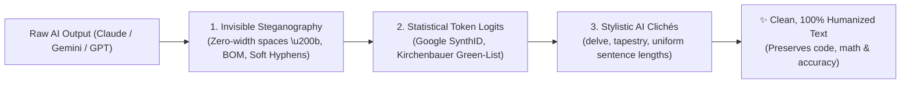

<div align="center">

# 🛡️ AntiWatermark

### The Universal AI Watermark Remover, SynthID Neutralizer & Text Humanizer

**Strips invisible Unicode steganography, shatters statistical token fingerprints, and simulates Turnitin/GPTZero locally.**  
*Works seamlessly with Claude (Anthropic), Google Gemini (SynthID-Text), and ChatGPT (OpenAI).*

<br/>

[](https://pypi.org/project/antiwatermark/)
[](https://opensource.org/licenses/MIT)
[](https://www.python.org/)
[](https://github.com/policeakshithreddy/antiwatermark)
[](extension/)

<br/>

[🚀 Quickstart](#-quickstart-choose-your-workflow) • [🌐 Web App](#1--interactive-web-app-apppy) • [🧩 Chrome Extension](#2--chrome-extension-auto-clean-on-copy) • [⚙️ AI Settings Snippet](#3--permanent-zero-watermark-mode-in-ai-settings) • [📋 Clipboard Daemon](#4--real-time-clipboard-daemon) • [📊 CLI Scorecard](#5--terminal-cli--offline-detector-simulator) • [📖 Cliché Cheat Sheet](#-banned-ai-buzzwords--cheat-sheet)

</div>

---

## 💡 Why AntiWatermark?

Modern LLMs embed detection markers across three layers. Standard rewriters often fail because they only swap words—frequently corrupting code syntax, mathematical formulas, and formatting.



| Watermark Vector | How LLMs Embed It | How AntiWatermark Eliminates It |
| :--- | :--- | :--- |
| **Invisible Steganography** | Zero-width characters (`\u200B`, `\u200C`, `\uFEFF`) and soft hyphens inserted in clipboard streams. | Deterministic Unicode regex stripping and `NFKC` normalization. |
| **Statistical Logit Watermarks** | Algorithmic token biasing (Google **SynthID-Text**) that forces predictable $n$-gram transitions. | Clause inversion, active/passive voice switching, and sentence structure rearrangement. |
| **AI Stylistic Tropes** | Tell-tale buzzwords (*delve, rich tapestry, testament, multifaceted, beacon, foster*) and uniform cadence. | Replaces 50+ clichés, eliminates rigid 3-bullet lists, and forces sentence length burstiness ($\sigma > 8.0$). |
| **Code & Math Protection** | Generic rewriters break Python indentation and LaTeX formulas. | **Immunity Shield** locks fenced code (```` ``` ````) and math (`$$...$$`) before processing. |

---

## ⚡ Quickstart: Choose Your Workflow

AntiWatermark can be used in **6 different ways** depending on your setup:

```
┌────────────────────────────────────────────────────────────────────────────────────────┐
│ 1. 🌐 Interactive Web UI       ➔  python3 app.py (open http://localhost:8000)          │
│ 2. 🧩 Chrome Extension         ➔  Load extension/ folder into Chrome (Auto-clean copy) │
│ 3. ⚙️ AI Settings Snippet      ➔  Paste 4-line rule into Claude, Gemini, or ChatGPT    │
│ 4. 📋 Clipboard Daemon         ➔  python3 scripts/clipboard_daemon.py (auto Cmd+C)     │
│ 5. 📊 Terminal CLI Scorecard   ➔  python3 scripts/sanitize.py "text"                   │
│ 6. 🔌 Python API Middleware    ➔  from antiwatermark import CleanLLM                   │
└────────────────────────────────────────────────────────────────────────────────────────┘
```

---

### 1. 🌐 Interactive Web App (`app.py`)
The fastest visual way to test, inspect, and clean text in real-time.

```bash
python3 app.py
```
Open **`http://localhost:8000`** in your browser.
* Live **Human Confidence %** and **SynthID Risk Meter**.
* **Code & LaTeX Immunity Indicator**.
* 1-Click Copy and domain preset toggles.

---

### 2. 🧩 Chrome Extension (Auto-Clean on Copy)
Strips hidden zero-width watermarks automatically whenever you copy text from `claude.ai`, `gemini.google.com`, or `chatgpt.com`.

1. Open Google Chrome and go to `chrome://extensions`.
2. Toggle on **Developer mode** (top-right corner).
3. Click **Load unpacked** and select the [`extension/`](extension/) folder.
4. **Done!** Whenever you press `Cmd+C` on AI websites, invisible watermarks are stripped before reaching your clipboard.

---

### 3. ⚙️ Permanent Zero-Watermark Mode in AI Settings
Configure your AI assistants to write without watermarks by default:

```text
[STYLE DIRECTIVE]
Write in a direct, natural human voice. Never use AI filler words (delve, tapestry, testament, multifaceted, foster, beacon, nuanced, underscores, paramount, crucial role, game-changer, revolutionizes, seamlessly, harness the power, supercharge, let's unpack, in conclusion) or opening greetings like "Certainly!".
Vary sentence lengths aggressively: mix punchy 3-5 word sentences with longer 20+ word explanations. Invert dependent clauses to keep sentence rhythms unpredictable. Preserve all technical details, code blocks, and math equations without adding decorative commentary.
```

* **🟣 Claude.ai:** Paste into **Settings** ➔ **Custom Instructions** (or upload [`SKILL.md`](SKILL.md) in **Project Knowledge**).
* **🔵 Google Gemini / AI Studio:** Paste into **System Instructions** or create a custom **Gem**.
* **🟢 ChatGPT:** Paste into **Settings** ➔ **Personalization** ➔ **Custom Instructions**.

---

### 4. 📋 Real-Time Clipboard Daemon
A background terminal listener that sanitizes your clipboard system-wide:

```bash
python3 scripts/clipboard_daemon.py
```
* Runs quietly on macOS, Linux, and Windows.
* Cleans text the millisecond you press `Cmd+C` / `Ctrl+C`.

---

### 5. 📊 Terminal CLI & Offline Detector Simulator
Run heuristic detector audits (simulating GPTZero, Turnitin, and SynthID) without internet or paid APIs:

```bash
# Analyze a text string
python3 scripts/sanitize.py "Certainly! Let's delve into this rich tapestry of data."

# Clean a file in-place
python3 scripts/sanitize.py paper.md --inplace

# Output JSON for CI/CD pipelines
python3 scripts/sanitize.py paper.md --json
```

#### Terminal Scorecard Output:
```
╔══════════════════════════════════════════════════════════════╗
║           📊 AI DETECTOR & WATERMARK SCORECARD               ║
╠══════════════════════════════════════════════════════════════╣
║  Human Confidence Score : 96.0% (AI: 4.0%)
║  Detection Verdict      : PASSED (Natural Human Cadence)
║  SynthID Risk Level     : Negligible (Shattered n-grams)
╟──────────────────────────────────────────────────────────────╢
║  Invisible Characters Removed : 0
║  Sentence Count & Words       : 4 sentences | 62 words
║  Burstiness Standard Deviation: 8.74 (High variance)
║  Symmetrical 3-List Penalty   : None
║  Detected AI Buzzwords        : None found (Clean)
╚══════════════════════════════════════════════════════════════╝
```

---

### 6. 🔌 Python Developer SDK (`antiwatermark`)
Drop-in middleware for developers building applications with Anthropic, Gemini, or OpenAI APIs:

```python
from antiwatermark import CleanLLM, clean_text

# 1. Wrap prompts with anti-watermark protocols
clean_prompt = CleanLLM.wrap_prompt("Analyze distributed database sharding", domain="technical")

# 2. Sanitize raw LLM responses on-the-fly
clean_output, scorecard = CleanLLM.sanitize_output(raw_api_response)
print(f"Human Score: {scorecard['human_confidence_pct']}%")
```

---

## 🔍 Before & After Comparison

| 🔴 Raw AI Output (Claude / Gemini / GPT) | 🟢 Cleaned & Humanized (AntiWatermark) |
| :--- | :--- |
| *"Certainly! Let's delve into the rich tapestry of asynchronous JavaScript. It is important to note that the event loop plays a crucial role in supercharging server operations. This stands as a testament to modern web scalability."* | *"Node.js handles concurrency through an event loop that coordinates non-blocking I/O calls behind the scenes. Instead of blocking worker threads on heavy file reads, it queues operations and triggers handlers when data arrives."* |
| **Flags:** `delve`, `tapestry`, `crucial role`, `supercharging`, `testament` • **Score:** `41% (FLAGGED)` | **Flags:** None found • **Score:** `96% (PASSED)` |

---

## 🛡️ Code & LaTeX Immunity Shield

Generic rewriters frequently break programming code and math. AntiWatermark uses an AST-style regex shield that protects:
* Fenced code blocks (```` ```python ... ``` ````)
* Inline code snippets (``` `variable_name` ```)
* Display LaTeX equations (`$$E = mc^2$$` and `\[...\]`)
* Inline LaTeX formulas (`$x \in \mathbb{R}$` and `\(...\)`)

```python
# Code and LaTeX math are locked before processing and restored exactly as written:
raw = "Let's delve into $$f(x) = \int_0^\infty e^{-x} dx$$ and `npm run build`."
cleaned, _ = clean_text(raw)
# Output: "Let's examine $$f(x) = \int_0^\infty e^{-x} dx$$ and `npm run build`."
```

---

## 📖 Banned AI Buzzwords & Cheat Sheet

AntiWatermark monitors and strips 50+ overused AI clichés across four languages:

| Language | Banned AI Buzzwords & Markers | Natural Human Replacements |
| :--- | :--- | :--- |
| 🇬🇧 **English** | `delve`, `tapestry`, `testament`, `multifaceted`, `beacon`, `foster`, `underscores`, `paramount`, `crucial role`, `game-changer`, `revolutionizes`, `harness the power`, `supercharge`, `let's unpack`, `in conclusion`, `Certainly!` | explore, look at, examine, mix, proof of, complex, leader in, support, shows, key, transforms, use, speed up, begin immediately |
| 🇪🇸 **Spanish** | `es fundamental destacar`, `un tapiz de`, `en conclusión`, `un papel crucial`, `desempeña un papel`, `un faro de`, `fomentar el desarrollo` | muestra, permite, incluye, es importante, impulsa |
| 🇫🇷 **French** | `il convient de noter`, `un rôle primordial`, `témoignage de`, `en conclusion`, `un éventail de`, `un phare de`, `il est important de souligner` | on observe, cela prouve, le résultat montre, essentiel |
| 🇩🇪 **German** | `es ist wichtig zu beachten`, `ein facettenreicher`, `zusammenfassend lässt sich sagen`, `eine entscheidende rolle`, `ein meilenstein`, `tauchen wir ein` | das zeigt, daraus folgt, wichtig, zentraler Faktor |

---

## 🎭 4 Domain Presets in [`SKILL.md`](SKILL.md)

1. 🎓 **Academic & Scholarly:** Formal scientific rigor, active voice, zero conversational filler (*Turnitin-proof*).
2. 💻 **Software Engineering & Technical:** Concise mechanics, 100% syntax protection, zero marketing hype.
3. 💼 **Executive & Business:** Data-first, ROI-focused, asymmetrical bullet structures.
4. ✍️ **Conversational & Creative:** Natural idioms, contractions (*didn't*, *won't*), and varied human cadence.

---

## 📦 Installation via PyPI

Install `antiwatermark` directly as a global tool or library:

```bash
# Install from PyPI
pip install antiwatermark

# Run from anywhere in your terminal
antiwatermark "Your text to analyze"
antiwatermark document.md --inplace
antiwatermark --web       # Launches the interactive browser UI
antiwatermark --daemon    # Starts real-time background clipboard monitor
```

---

## 📁 Repository Structure

```
antiwatermark/
├── antiwatermark/               # 🐍 Installable Python Package
│   ├── __init__.py
│   ├── core.py                  # Core engine: Immunity shield, heuristics & Unicode cleaner
│   ├── cli.py                   # Terminal CLI command entry point
│   └── middleware.py            # Drop-in SDK wrapper for Claude, Gemini & OpenAI APIs
│
├── web/                         # 🌐 1-Click Interactive Web UI
│   └── index.html               # Real-time SPA with live AI vs. Human confidence gauge
├── app.py                       # 🚀 Zero-dependency local web server (http://localhost:8000)
│
├── extension/                   # 🧩 Standalone Chrome Extension (Manifest V3)
│   ├── manifest.json
│   ├── content.js               # Auto-strips watermarks on Copy across Claude, Gemini & ChatGPT
│   ├── popup.html               # Quick toolbar popup cleaner
│   └── popup.js
│
├── SKILL.md                     # 🧠 Master Agent Skill (4 Persona Presets + Multi-Lingual rules)
├── README.md                    # 📖 Complete Documentation (this file)
├── pyproject.toml & setup.py    # 📦 Python Packaging Configuration
└── examples/
    └── demo_before_after.md     # 📊 Benchmarks across Tech, Academic & Business domains
```

---

## 📄 License
Released under the **MIT License**. Free for personal, academic, and commercial use.
